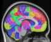

# NeMo 2.1 - Network Modification Tool
Predict brain network disruption from a lesion mask. Original concept described in [Kuceyeski 2013](https://pubmed.ncbi.nlm.nih.gov/23855491/).

**NEW!** Cloud interface for this tool can be used here: [https://kuceyeski-wcm-web.s3.amazonaws.com/nemo/index.html](https://kuceyeski-wcm-web.s3.amazonaws.com/nemo/index.html)

# Contents
1. [Workflow overview](#workflow-overview)
2. [Inputs](#inputs)
3. [Outputs](#outputs)
    1. [Code examples for parsing outputs](#code-examples-for-parsing-outputs)
4. [Website usage](#website-usage)
5. [Requirements](#requirements)
6. [Details of tractography database](#details-of-tractography-database)
7. [Parcellations](#parcellations)

# Workflow overview

The general workflow for this tool consists of a database generation stage and a lesion disconnectivity stage:

1. Tractography database generation: [databaseprep/](databaseprep/)
    1. Compute whole-brain tractogram streamlines for 420 unrelated healthy subjects from the [Human Connectome Project](http://www.humanconnectome.org) (See [hcp_subjects_unrelated420_scfc.txt](hcp_subjects_unrelated420_scfc.txt) for list)
        * Both probabilistic (iFOD2+ACT) and deterministic (SD_STREAM) are available
    2. Nonlinearly warp streamlines into a common reference space (MNI152 v6, eg: <code>$FSLDIR/data/standard/MNI152_T1_1mm.nii.gz</code>, or [website/atlases/MNI152_T1_1mm_brain.nii.gz](website/atlases/MNI152_T1_1mm_brain.nii.gz))
        * See [run_warp_tck_to_mni.sh](databaseprep/run_warp_tck_to_mni.sh) and [nemo_convert_mni_tck_to_sparsemat.py](databaseprep/nemo_convert_mni_tck_to_sparsemat.py)
    3. Additional processing to facillitate efficient computation: [run_full_database_prep.sh](databaseprep/run_full_database_prep.sh)
2. Lesion to disconnectivity mapping: [nemo_lesion_to_chaco.py](nemo_lesion_to_chaco.py)
    1. Given a lesion mask, identify all streamlines it intersects, and identify the endpoints of those streamlines to compute brain regions for which we expect a reduction of connectivity
    2. Compute ChaCo (Change in Connectivity) score, which is the ratio of (disrupted streamlines)/(total streamlines) for each voxel or ROI (chacovol), or voxel/ROI pair (chacoconn). **0=no disconnection. 1=complete disconnection**

We have created a user-friendly web interface to run this tool in the cloud (AWS):
* Main web GUI code in [uploader.js](website/uploader.js)
* Uploading via this website triggers an AWS Lambda event, which executes [s3-lambda.py](website/config/s3-lambda.py) to launch an AWS EC2 instance
* On the EC2 instance, [nemo_startup.sh](website/config/nemo_startup.sh) manages the entire input/output workflow, and uploads the results to S3, triggering a second AWS Lambda event in [s3-lambda.py](website/config/s3-lambda.py) that emails the user a link to the results

# Inputs
* **NOTE: All input volumes must already be transformed into 1mm MNI152 v6 space** (eg: using FSL's FNIRT or ANTs) 
    * 182x218x182 voxels (best) or 181x217x181 (this sometimes results if upsampling SPM 2mm output to 1mm)
    * Volumes matching either of these 2 sizes are then nearest-neighbor interpolated to the MNI template to avoid any voxel ordering issues.
* Lesion mask = NIfTI volume (*.nii.gz or *.nii)
* Parcellation (optional) = NIfTI volume with labeled voxels (*.nii.gz or *.nii)
    * Note: Pipeline only considers sequential ROI label values. For example, a parcellation containing only label values [10,20,30,40] will produce an 4x1 output, or a 4x4 output in pairwise mode
* Resolution = mm resolution for outputs. Default=1mm, but this leads to large output files for the pairwise <code>chacoconn</code> and 420-subject <code>*\_allref.pkl</code>
    * e.g., For a single very extensive lesion mask, <code>chacovol\_allref</code> can be as large as 700MB, and <code>chacoconn\_allref</code> can be 10s of GB
* Currently, this package treats the lesion volume as a binary mask (0 = healthy tissue, <0 or >0 = tissue damage)
    
# Outputs
* <code>chacovol</code> = voxelwise or regionwise ChaCo ratio
* <code>chacoconn</code> = pairwise ChaCo ratio of loss of connections between pairs of voxels and/or ROIs
    * Note: for parcellations, these will be upper triangular. For voxelwise (including downsampled), this is not guaranteed
* <code>\_chacovol\_(mean|stdev)</code> = mean and stdev of all 420 HCP-subject ChaCo ratio maps (for voxelwise outputs, these are .nii.gz files)
* <code>\_chacoconn\_(mean|stdev)</code> = mean and stdev of all 420 HCP-subject pairwise disconnectivity maps
* <code>\_nemoSC\_(mean|stdev)</code> = mean and stdev of predicted pairwise structural *connectivity* after removing disconnected streamlines for all 420 HCP-subject
* <code>chacovol_allref.pkl</code> = ChaCo ratio map for each of the 420 HCP reference subjects
    * 420x(voxels or ROIs) sparse matrix format
* <code>chacoconn_allref.pkl</code> = ChaCo ratio map for each of the 420 HCP reference subjects
    * 420-element list of (voxels x voxels) or (ROIs x ROIs) sparse matrices
* <code>*\_allref\_denom.pkl</code> = denominator of the ChaCo ratio for each subject (useful when recomputing ChaCo numerator and denominator for reparcellating ratios)

* <code>*.pkl</code> are [Python pickle format](https://docs.python.org/3/library/pickle.html) that can be read using:
    <code>import pickle; data = pickle.load(open("filename.pkl","rb"))</code>
* <code>*.npz</code> are [SciPy sparse matrices](https://docs.scipy.org/doc/scipy/reference/sparse.html) that can be read using:
        <code>import numpy as np; from scipy import sparse; data = sparse.load\_npz("filename.npz")</code>
* To convert outputs to another format, you will need to use Python. See examples below.

# Code examples for parsing outputs
### Load chacovol\_mean.pkl file and save as text/tsv/csv
<pre lang="python">
import pickle
import numpy as np
data = pickle.load(open("mylesion_chacovol_mean.pkl","rb"))
#data contains a single ROIxROI matrix
np.savetxt("mylesion_chacovol_mean.txt",data,delimiter="\t")

#or save as .mat
from scipy.io import savemat
savemat("mylesion_chacovol_mean.mat",{"data":data})
# (load in matlab with M=load("mylesion_chacovol_mean.mat"); data=M.data;)
</pre>

### Load chacoconn\_mean.pkl file and save as text/tsv/csv
<pre lang="python">
#NOTE: chacoconn files are *SPARSE* format and must be converted to *DENSE* before saving to text using data.toarray()
import pickle
import numpy as np
data = pickle.load(open("mylesion_chacoconn_mean.pkl","rb"))
np.savetxt("mylesion_chacoconn_mean.txt",data.toarray(),delimiter="\t")

#or save dense/full matrix to matlab .mat:
from scipy.io import savemat
savemat("mylesion_chacoconn_mean.mat",{"data":data.toarray()})
# (load in matlab with M=load("mylesion_chacoconn_mean.mat"); data=M.data;)

#sparse chacoconn outputs *CAN* be saved as sparse format in .mat files *ONLY IF* you convert them to np.double:
from scipy.io import savemat
savemat("mylesion_chacoconn_mean_sparse.mat",{"data":data.astype(np.double)})
# (load in matlab with M=load("mylesion_chacoconn_mean_sparse.mat"); data=M.data; or data=full(M.data); ... )
</pre>

### Load chacovol\_\*\_allref.pkl or chacovol\_\*\_allref\_denom.pkl files and save as matlab .mat
<pre lang="python">
#These files contain SPARSE matrices, so we need to either convert them to dense:
import pickle
import numpy as np
from scipy.io import savemat
data = pickle.load(open("mylesion_chacovol_fs86subj_allref.pkl","rb"))
savemat("mylesion_chacovol_fs86subj_allref.mat",{"allref":data.toarray()})
# (load in matlab with M=load("mylesion_chacovol_fs86subj_allref.mat"); allref=M.allref;)

#or save as sparse after converting to np.double:
savemat("mylesion_chacovol_fs86subj_allref_sparse.mat",{"allref":data.astype(np.double)})
# (load in matlab with M=load("mylesion_chacovol_fs86subj_allref.mat"); allref=M.allref; or allref=full(M.allref); ...)
</pre>

### Load chacoconn\_\*\_allref.pkl or chacoconn\_\*\_allref\_denom.pkl files and save as matlab .mat
<pre lang="python">
#These files contain LISTS of SPARSE matrices, so we need to either
#a) convert them all to dense and stack them into 3D:
import pickle
import numpy as np
from scipy.io import savemat
data = pickle.load(open("mylesion_chacoconn_fs86subj_allref.pkl","rb"))
allref=np.stack([x.toarray() for x in data], axis=2) #creates an 86x86x420 3D matrix
savemat("mylesion_chacoconn_fs86subj_allref.mat",{"allref":allref})
# (load in matlab with M=load("mylesion_chacoconn_fs86subj_allref.mat"); allref=M.allref;)

#or b) save as a cell array of of sparse matrices to save space, but you MUST convert to np.double:
allref=[x.astype(np.double) for x in data]
savemat("mylesion_chacoconn_fs86subj_allref_sparse.mat",{"allref":allref})
# (load in matlab with M=load("mylesion_chacoconn_fs86subj_allref.mat"); allref=M.allref; allref_subj1=M.allref{1}; allref_subj1_full=full(M.allref{1}); ...)
</pre>

### Load chacoconn\_resXmm\_mean.pkl file for VOXEL-PAIRWISE output
<pre lang="python">
#chacoconn_mean is a VOXELSxVOXELS pairwise matrix, where chacoconn_mean[i,:] represents 
# a VOLUME of disconnectivity to from voxel i to all other voxels
import pickle
import numpy as np
import nibabel as nib
from nilearn import plotting

#read the corresponding chacovol_resXmm_mean.nii.gz output which defines the output dimensions
Vref = nib.load("mylesion_chacovol_res5mm_mean.nii.gz")

data = pickle.load(open("mylesion_chacoconn_res5mm_mean.pkl","rb"))

#for this demonstration, find the voxel with the largest total disconnectivity, convert that row
#of the chacoconn output to a volume, and visualize that volume
data_sum=np.sum(data,axis=0)+np.sum(data,axis=1).T #data is upper triangular so we need to sum across both dimensions
voxel_index=np.argmax(data_sum)
newdata=data[voxel_index,:]+data[:,voxel_index].T
Vnew=nib.Nifti1Image(np.reshape(newdata.toarray(),Vref.shape),affine=Vref.affine, header=Vref.header)

#convert voxel index to coordinates we can include the position in the output filename
voxel_ijk=np.unravel_index(voxel_index,Vref.shape) #convert to (i,j,k) coords
voxel_xyz=(Vref.affine @ np.array(voxel_ijk+(1,)).T)[:3] #can also convert to x,y,z mm using Vref affine
voxel_ijk_string="%d_%d_%d" % (voxel_ijk)

#save glassbrain image of this volume using nilearn plotting tools
plotting.plot_glass_brain(Vnew,output_file="mylesion_chacoconn_res5mm_voxel_%s.png" % (voxel_ijk_string),colorbar=True)

#save volume as nii.gz so you can view it in nifti-viewing software (eg: fsleyes)
nib.save(Vnew,"mylesion_chacoconn_res5mm_voxel_%s.nii.gz" % (voxel_ijk_string))

#just for fun, save a second volume with JUST that seed voxel highlighted so we can overlay it later
cursordata=np.zeros(data.shape[0])
cursordata[voxel_index]=1
Vcursor=nib.Nifti1Image(np.reshape(cursordata,Vref.shape),affine=Vref.affine, header=Vref.header)
nib.save(Vcursor,"mylesion_chacoconn_res5mm_voxel_%s_cursor.nii.gz" % (voxel_ijk_string))
</pre>

# Website usage
* Coming soon

# Requirements
* No software is required to submit lesion masks through our web interface. To process outputs or to run portions of this this pipeline on your own, you will need the following:
    * Python 3.6+
    * NumPy
    * SciPy
    * NiBabel
    * Nilearn >= 0.6.0 (needed mainly for visualization)

# Details of tractography database
* Anatomical and diffusion data preprocessed by HCP using [Minimal Processing Pipeline](https://github.com/Washington-University/HCPpipelines) ([Glasser 2013](https://doi.org/10.1016/j.neuroimage.2013.04.127))
    * 3T diffusion MRI collected at 1.25mm resolution, 3 shells (b=1000,2000,3000), 90 directions per shell (See: [HCP 3T Protocol](https://protocols.humanconnectome.org/HCP/3T/imaging-protocols.html))
    * Gradient nonlinearity correction, EPI distortion correction, eddy current correction, motion correction, rigid-body registration to subject anatomy
* [MRtrix3](https://www.mrtrix.org/) was used to estimate a voxelwise multi-shell, multi-tissue constrained spherical deconvolution (CSD) model and then compute whole brain tractography for each HCP subject
    * [<code>5ttgen</code>](https://mrtrix.readthedocs.io/en/dev/reference/commands/5ttgen.html), [<code>dwi2response dhollander</code>](https://mrtrix.readthedocs.io/en/latest/reference/commands/dwi2response.html#dwi2response-dhollander), [<code>dwi2fod msmt\_csd</code>](https://mrtrix.readthedocs.io/en/latest/reference/commands/dwi2fod.html)
    * Probabilistic tractography with anatomical constraint (iFOD2+ACT) and dynamic seeding:
        * [<code>tckgen RF_wm_dhollander.mif tracts_ifod2act_5M.tck -algorithm iFOD2 -act 5TT.nii.gz -seed_dynamic RF_wm_dhollander.mif -cutoff 0.06 -maxlength 300 -select 5M</code>](https://mrtrix.readthedocs.io/en/latest/reference/commands/tckgen.html)
    * Deterministic tractography (SD_STREAM) with dynamic seeding:
        * [<code>tckgen RF_wm_dhollander.mif tracts_sdstream_5M.tck -algorithm SD_STREAM -seed_dynamic RF_wm_dhollander.mif -cutoff 0.06 -maxlength 300 -select 5M -downsample 3</code>](https://mrtrix.readthedocs.io/en/latest/reference/commands/tckgen.html)
    * 5 million streamlines per subject
    * Additionally estimate SIFT2 weights for each streamline to better match global tractography to observed diffusion images ([<code>tcksift2</code>](https://mrtrix.readthedocs.io/en/latest/reference/commands/tcksift2.html))
* 3D streamline coordinates were then transformed into discretized 1mm MNI space
    * Uses the warp file from HCP <code>$SUBJID/MNINonLinear/xfms/standard2acpc\_dc.nii.gz</code> (Note this is the MNI->T1 volume warp that is used to map streamlines from T1->MNI)
    * Round (x,y,z) coordinates to the nearest integer, and for each subject create a (7M voxels)x(5M streamlines) binary sparse matrix describing which of the 7M voxels (182\*218\*182=7,221,032) each of the 5M streamlines passes through
* This set of 420 7Mx5M sparse matrices can be used to compute ChaCo scores, but would require downloading the entire 700GB database every single time we run the tool. Instead, we divide the sparsemats into 10x10x10 voxel "chunks", where each chunk file contains the [420*1000 x 5M] sparse matrix of streamlines for all 420 subjects through that cube of MNI space. Thus, we only download the "chunks" that overlap the input mask to determine which streamlines intersect our lesion. 

# Parcellations
* <code>FreeSurfer86-subj</code>: 86-region FreeSurfer Desikan-Killiany (DKT) cortical atlas with "aseg" subcortical regions(ie: aparc+aseg.nii.gz) [Desikan 2006](https://pubmed.ncbi.nlm.nih.gov/16530430/), [Fischl 2002](https://pubmed.ncbi.nlm.nih.gov/11832223/)
    * This atlas includes the 68 cortical DKT regions + 18 subcortical (excluding brain-stem)
    * For this atlas, each of the 420 HCP reference subjects has their own subject-specific parcellation that we use when assigning streamlines to ROIs
* <code>FreeSurferSUIT111-subj</code>: 111-region atlas with 68 DKT cortical + 16 aseg subcortical + 27 cerebellar subregions from the SUIT atlas [Diedrichsen 2009](https://pubmed.ncbi.nlm.nih.gov/19457380/)
    * Like FreeSurfer86, this is a subject-specific parcellation. 
    * SUIT ROIs are dilated and masked to fill all FreeSurfer cerebellum voxels
* <code>FreeSurferSUIT191-subj</code>: 191-region atlas with 148 Destrieux (aparc.a2009s) cortical + 16 aseg subcortical + 27 cerebellar subregions from the SUIT atlas [Destrieux 2010](https://pubmed.ncbi.nlm.nih.gov/20547229/)
    * Like FreeSurfer86, this is a subject-specific parcellation. 
    * SUIT ROIs are dilated and masked to fill all FreeSurfer cerebellum voxels
* <code>CocoMMP438-subj</code>: 438-region atlas combining parts of several atlases:
    * 358 cortical ROIs from the HCP multi-modal parcellation ([Glasser 2016](https://pubmed.ncbi.nlm.nih.gov/27437579/))
    * 12 subcortical ROIs from aseg, adjusted by FSL's FIRST tool ([Patenaude 2011](https://pubmed.ncbi.nlm.nih.gov/21352927/))
    * 30 thalamic nuclei from FreeSurfer7 [Iglesias 2018](https://pubmed.ncbi.nlm.nih.gov/30121337/) (50 nuclei merged down to 30 to remove the smallest nuclei, as with AAL3v1)
    * 12 subcortical nuclei from AAL3v1 [Rolls 2020](https://pubmed.ncbi.nlm.nih.gov/31521825/) (VTA L/R, SN_pc L/R, SN_pr L/R, Red_N L/R, LC L/R, Raphe D/M)
    * 26 cerebellar lobes from AAL3v1 (9 left, 9 right, 8 vermis)
    * Like FreeSurfer86-subj, this is a subject-specific parcellation
* <code>CocoMMPsuit439-subj</code>: 439-region atlas from CocoMMP438, but with 27 SUIT cerebellar subregions instead of 26 from AAL3v1
    * Like FreeSurfer86, this is a subject-specific parcellation
* <code>CocoYeo143-subj</code>: 143-region atlas combining Schaefer100 cortical ROIs + 16 aseg subcortical + 27 cerebellar subregions from SUIT [Schaefer 2018](https://pubmed.ncbi.nlm.nih.gov/28981612/)
* <code>CocoYeo243-subj</code>: 243-region atlas combining Schaefer200 cortical ROIs + 16 aseg subcortical + 27 cerebellar subregions from SUIT [Schaefer 2018](https://pubmed.ncbi.nlm.nih.gov/28981612/)
* <code>CocoYeo443-subj</code>: 243-region atlas combining Schaefer400 cortical ROIs + 16 aseg subcortical + 27 cerebellar subregions from SUIT [Schaefer 2018](https://pubmed.ncbi.nlm.nih.gov/28981612/)
* <code>CocoLaus157-subj</code>: 157-region atlas combining Lausanne116 (114 cortical ROIs) + 16 aseg subcortical + 27 cerebellar subregions from SUIT [Daducci 2012](https://pubmed.ncbi.nlm.nih.gov/23272041/)
    * Corpus callosum is excluded from the Lausanne
    * Lausanne ROIs are re-ordered to group subparcels of the original Desikan-Killiany gyral parcels
* <code>CocoLaus262-subj</code>: 262-region atlas combining Lausanne221 (219 cortical ROIs) + 16 aseg subcortical + 27 cerebellar subregions from SUIT [Daducci 2012](https://pubmed.ncbi.nlm.nih.gov/23272041/)
    * Corpus callosum is excluded from the Lausanne221
    * Lausanne221 ROIs are re-ordered to group subparcels of the original Desikan-Killiany gyral parcels
* <code>CocoLaus491-subj</code>: 491-region atlas combining Lausanne450 (448 cortical ROIs) + 16 aseg subcortical + 27 cerebellar subregions from SUIT [Daducci 2012](https://pubmed.ncbi.nlm.nih.gov/23272041/)
    * Corpus callosum is excluded from the Lausanne450
    * Lausanne450 ROIs are re-ordered to group subparcels of the original Desikan-Killiany gyral parcels
* <code>FreeSurfer86-avg</code>, <code>FreeSurferSUIT111-avg</code>, <code>CocoMMP438-avg</code>, <code>CocoMMPsuit439-avg</code>: Same regions as -subj but defined as a single group-level MNI volume 
    * Each subject parcellation was mode-dilated by 1mm, then we computed the mode across all subjects
    * *These averaged atlases are deprecated, replaced by subject-specific versions*
* <code>AAL</code>: 116-region Automated Anatomical Labeling atlas from [Tzourio-Mazoyer 2002](https://pubmed.ncbi.nlm.nih.gov/11771995/)
* <code>AAL3</code>: 166-region AAL3v1 atlas from [Rolls 2020](https://pubmed.ncbi.nlm.nih.gov/31521825/).
    * Updated from AAL to include 30 high-resolution thalamic nuclei and 12 subcortical nuclei
* <code>CC200</code>: 200-region whole-brain cortical+subcortical parcellation from [Craddock 2012](https://pubmed.ncbi.nlm.nih.gov/21769991/)
* <code>CC400</code>: 400-region (actually 392) cortical+subcortical parcellation from [Craddock 2012](https://pubmed.ncbi.nlm.nih.gov/21769991/)
* <code>Shen268</code>: 268-region cortical+subcortical atlas from [Shen 2013](https://pubmed.ncbi.nlm.nih.gov/23747961/)
* <code>Yeo7</code>: 7-network CORTICAL-ONLY parcellation from [Yeo 2011](https://pubmed.ncbi.nlm.nih.gov/21653723/)
* <code>Yeo17</code>: 17-network CORTICAL-ONLY parcellation from [Yeo 2011](https://pubmed.ncbi.nlm.nih.gov/21653723/)
* <code>Custom</code>: Any 1mm MNI (182x218x182) parcellation volume
    * Note: Pipeline only considers sequential ROI label values. For example, a parcellation containing only label values [10,20,30,40] will produce an 4x1 output, or a 4x4 output in pairwise mode
* See files in [website/atlases/](website/atlases/)

 
  

 
 
       
